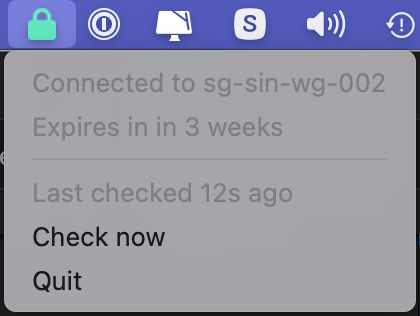

# Mullvad Checker

A simple tray icon indicator of your Mullvad connection status, with DNS leak check.

I wrote this because I connect to Mullvad on my router and I wanted a simple way to know if the connection is up without going to the website.

## Development

    yarn start

## Build

    yarn run build
